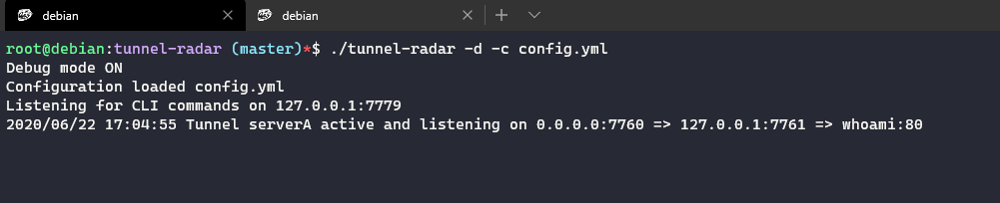

# Tunnel Radar

<div style="text-align:center"></div>

   

A tool to manage your SSH tunnels


## Requirements 📋

* `Go` if you want to build the project from source (otherwise download one of the releases)

## Installation 🚧
```bash
# Download from the repository
$ git clone https://github.com/bvison/tunnel-radar.git
$ cd tunnel-radar
$ go build -o tunnel-radar
```

You should see a `tunnel-radar` binary inside the folder

### Installing the service

If you want the service to be registered as a service:

```bash
$ cp tunnel-radar.service /lib/system/systemd/tunnel-radar.service
$ systemctl daemon reload
```

Make sure to edit the `tunnel-radar.service` to specify the correct path to the configuration file. By default, it looks for it in `/etc/tunnel-radar/config.yml`

You should see a `tunnel-radar` binary inside the folder

## Configuration 🛃

`tunnel-radar` feeds its configuration from a YAML file  that. This is a full sample configuration:

```yaml
tunnels:
  tunnelA:
    disabled: false
    source: "0.0.0.0:7778"
    remote: "127.0.0.1:22"
    destination: "10.0.0.1:80"
    auth:
      user: "root"
      # Either password or key are required
      password: "password"
      key: "/root/.ssh/id_rsa"

```
## Usage 🏹

`tunnel-radar` exposes some flags:

* **-c**: Specify the configuration file to use
* **-d**: Enable additional debugging output
* **-i**: Enable CLI mode, this is used to run `tunnel-radar`'s CLI to communicate with the service
* **-ih**: The `host` to connect to when using CLI (defaults to 127.0.0.1)
* **-ip**: The `port` to connect to when using CLI (defaults to 7779)

**On Linux**:
```bash
$ ./tunnel-radar -d -c config.yml
```

**On Windows**:
```bash
$ tunnel-radar.exe -d -c config.yml
```
You should see something like:

<div style="text-align:center"></div>

If so the service is ready to accept connections on the different enabled tunnels.

## CLI Usage 💻

TBD.

## TODO :wrench:
* Add more configuration options
* Add retry in case tunnel goes down
* Add Makefile
* Docker deployment & Build
* Organize code structure
* Make use of channels to improve communication
* Improve error handling
* Improve reading of commands
* Handle connection changes more appropriately
* Add tests
* Run benchmarks
* Ansible deployment

## Contribution :construction_worker:

TBD.
